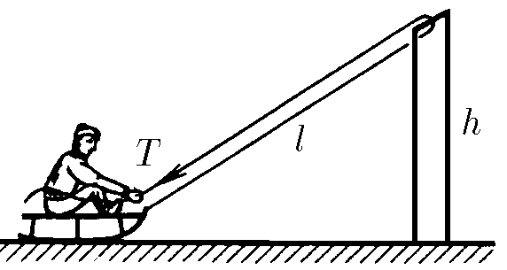
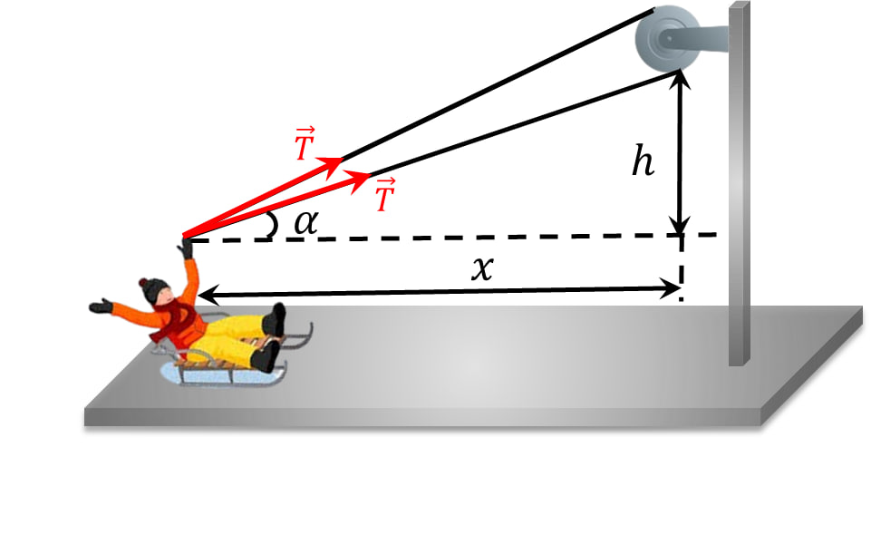

###  Условие: 

$2.3.18^*.$ Веревка привязана к санкам и переброшена через перекладину ворот высоты $h$. Мальчик, сидящий на санках, начинает выбирать веревку, натягивая ее с силой $T$. Какую скорость он приобретет, проезжая под перекладиной? Начальная длина натянутой части веревки $2l$, масса мальчика с санками $m$. Трением пренебречь. 

###  Решение: 

 

На санки действует единственная внешняя сила $2\vec{T}$, направленная под углом $\alpha$ к горизонту  

$$F_x=2T\cos\alpha\tag{1}$$  

Из рисунка:  

$$\cos\alpha =\frac{x}{\sqrt{x^2+h^2}}\tag{2}$$  

Тогда  

$$F_x=T\frac{2x}{\sqrt{x^2+h^2}}\tag{3}$$  

Работа внешней силы равна:  

$$A=\int_{0}^{x_0}F_xdx\tag{4}$$ 

$$A=2T\int_{0}^{x_0}\frac{x}{\sqrt{x^2+h^2}}dx\tag{5}$$ 

$$\int\frac{x}{\sqrt{x^2+h^2}}dx=\sqrt{x^2+h^2}+C\tag{6}$$ 

$$\int_{0}^{x_0}\frac{x}{\sqrt{x^2+h^2}}dx=\sqrt{x_0^2+h^2}-h\tag{7}$$  

По условию:  

$$L=\sqrt{x^2+h^2}\tag{8}$$  

Тогда $(5)$ можно переписать:  

$$A=2T(L-h)\tag{9}$$  

Энергия внешней силы перешла в кинетическую энергию санок $(A=E_{кин})$:  

$$2T(L-h)=\frac{mv^2}{2}\tag{10}$$  

Отсюда:  

$$v=\sqrt{\frac{4T(L-h)}{m}}\tag{11}$$ 

####  Ответ: $v=2\sqrt{\frac{T(L-h)}{m}}$ 
