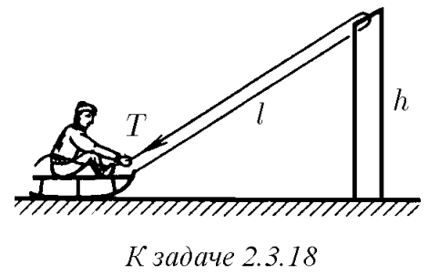

###  Условие: 

$2.3.18^*.$ Веревка привязана к санкам и переброшена через перекладину ворот высоты $h$. Мальчик, сидящий на санках, начинает выбирать веревку, натягивая ее с силой $T$. Какую скорость он приобретет, проезжая под перекладиной? Начальная длина натянутой части веревки $2l$, масса мальчика с санками $m$. Трением пренебречь. 

###  Решение: 

 

На санки действует единственная внешняя сила $2\vec{T}$, направленная под углом $\alpha$ к горизонту  $F_x=2T\cos\alpha$  Из рисунка:  $\cos\alpha =\frac{x}{\sqrt{x^2+h^2}}$  Тогда  $F_x=T\frac{2x}{\sqrt{x^2+h^2}}$  Работа внешней силы равна:  $A=\int_{0}^{x_0}F_xdx$ $A=2T\int_{0}^{x_0}\frac{x}{\sqrt{x^2+h^2}}dx\quad(a)$ $\int\frac{x}{\sqrt{x^2+h^2}}dx=\sqrt{x^2+h^2}+C$ $\int_{0}^{x_0}\frac{x}{\sqrt{x^2+h^2}}dx=\sqrt{x_0^2+h^2}-h$  По условию:  $L=\sqrt{x^2+h^2}$  Тогда $(a)$ можно переписать:  $A=2T(L-h)$  Энергия внешней силы перешла в кинетическую энергию санок:  $A=E_{кин}$ $2T(L-h)=\frac{mv^2}{2}$  Отсюда:  $v=\sqrt{\frac{4T(L-h)}{m}}$ 

###  Ответ: $v=2\sqrt{\frac{T(L-h)}{m}}$ 

### 
