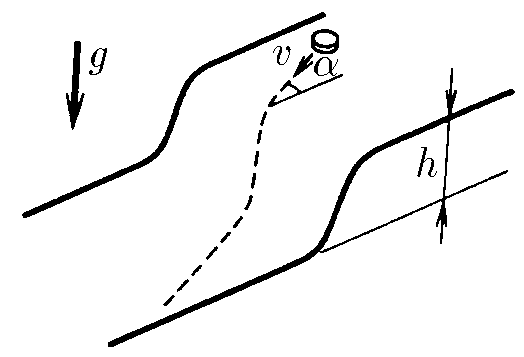
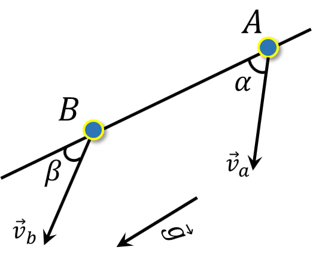

###  Условие:

$2.3.20.$ Горизонтальные поверхности, отстоящие друг от друга по высоте на $h$, плавно соединяются. По верхней поверхности движется тело со скоростью $v$, составляющей угол $\alpha$ с нормалью к линии сопряжения. Найдите угол между скоростью тела на нижней поверхности плоскости и нормалью к линии сопряжения. Трением пренебречь.

###  Решение:

Из-за отсутствия внешних сил по нормали, нормальная компонента скорости будет оставаться неизменной:

$$
v_a \cdot\sin\alpha =v_b \cdot\sin\beta
$$

Откуда, скорость тела на нижней поверхности:

$$
v_b =v_a \frac{\sin\alpha}{\sin\beta}\tag{1}
$$

Между тем, на тело действует сила тяжести, направленная параллельно отрезку $AB$. Запишем работу этой силы:

$$
mgh= \frac{m \cdot v^2_b }{2}-\frac{m \cdot v^2_a }{2}
$$

Упрощаем:

$$
v^2_b= v^2_a + 2gh\tag{2}
$$

Приравниваем $(1)$ и $(2)$

$$
v^2_a \frac{\sin^2 \alpha}{\sin^2 \beta}= v^2_a + 2gh
$$

Решаем относительно $\sin\beta$:

$$
\sin\beta = \sin\alpha\frac{v_a}{\sqrt{v^2_a+2gh}}
$$

####  Ответ: $\sin\beta = \sin\alpha\frac{v_a}{\sqrt{v^2_a+2gh}}$