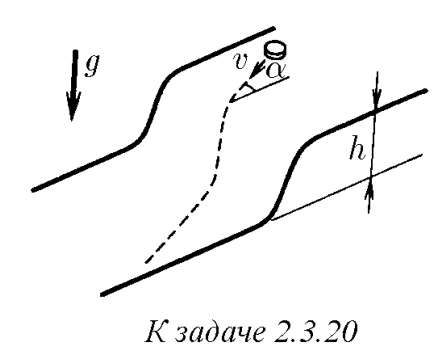

###  Условие: 

$2.3.20.$ Горизонтальные поверхности, отстоящие друг от друга по высоте на $h$, плавно соединяются. По верхней поверхности движется тело со скоростью $v$, составляющей угол $\alpha$ с нормалью к линии сопряжения. Найдите угол между скоростью тела на нижней поверхности плоскости и нормалью к линии сопряжения. Трением пренебречь. 

###  Решение: 

 

Из-за отсутствия внешних сил по нормали, нормальная компонента скорости будет оставаться неизменной:  $v_a \cdot\sin\alpha =v_b \cdot\sin\beta$ $v_b =v_a \frac{\sin\alpha}{\sin\beta}\quad(a)$  Между тем, на тело действует сила тяжести, направленная параллельно отрезку $AB$. Запишем работу этой силы:  $mgh= \frac{m \, v^2_b }{2}-\frac{m \, v^2_a }{2}$ $v^2_b= v^2_a + 2gh$  Подставляем $(a)$:  $v^2_a \frac{\sin^2 \alpha}{\sin^2 \beta}= v^2_a + 2gh$ $\sin\beta = \sin\alpha\frac{v_a}{\sqrt{v^2_a+2gh}}$ 

###  Ответ: $\sin\beta = \sin\alpha\frac{v_a}{\sqrt{v^2_a+2gh}}$ 

### 
