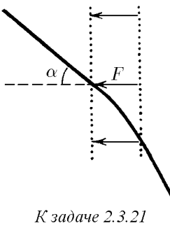

###  Условие: 

$2.3.21.$ Частица массы $m$ со скоростью $v$ влетает в область действия тормозящей силы $F$ под углом $\alpha$ к направлению этой силы. Под каким углом к направлению силы $F$ она вылетит из этой области? Ширина области действия силы $l$. При каком условии частица не сможет пересечь эту область? 

###  Решение: 

Т.к. на плоскости $XY$ действует постоянная единственная внешняя сила $\vec{F}$, то компонента скорости по оси $OY$ будет оставаться неизменной:  $v_0\cdot \sin\alpha =v_1\cdot \sin\beta\quad(a)$  Запишем Закон Сохранения Энергии:  $\frac{mv^2_0}{2}=\frac{mv^2_1}{2}+FL$ $v^2_0=v^2_1+2\frac{FL}{m}$  Подставляем $(a)$:  $v^2_0\cdot \frac{\sin^2\alpha}{\sin^2 \,\beta}=v^2_0-2\frac{FL}{m}$ $\frac{\sin^2\alpha}{\sin^2 \,\beta}=1-2\frac{FL}{mv^2_0}$ $\sin\beta = \frac{\sin\alpha}{\sqrt{1-2\frac{FL}{mv^2_0}}}\quad(b)$  Рассмотрим область определения $(b)$. Т.к. $\sqrt{1-2\frac{FL}{mv^2_0}} > 0$:  $\frac{mv^2_0}{2} \geq FL$  Т.к. $\sin\beta\leq 1$:  $\sin^2\alpha\leq 1-2\frac{FL}{mv^2_0}$ $2\frac{FL}{mv^2_0} \leq \cos^2\alpha$ $2\frac{FL}{mv^2_0} \leq \cos^2\alpha$ $ FL\leq \frac{mv^2_0}{2} \cos^2\alpha$ 

###  Ответ: $\sin\beta = \frac{\sin\alpha}{\sqrt{1-2\frac{FL}{mv^2_0}}};$ при $ FL > \frac{mv^2_0}{2} \cos^2\alpha$ 

### 
