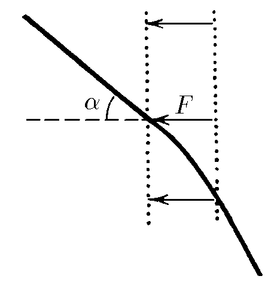

###  Условие: 

$2.3.21.$ Частица массы $m$ со скоростью $v$ влетает в область действия тормозящей силы $F$ под углом $\alpha$ к направлению этой силы. Под каким углом к направлению силы $F$ она вылетит из этой области? Ширина области действия силы $l$. При каком условии частица не сможет пересечь эту область? 

###  Решение: 

На частицу действует единственная внешняя сила \( \vec{F} \), направленная вдоль оси \( x \).  
Таким образом, компонента скорости по оси \( y \) не изменяется во время движения частицы:

$$v_0\cdot \sin\alpha =v_1\cdot \sin\beta\tag{1}$$  

Работа силы \( F \) уменьшает кинетическую энергию частицы. Применяя закон сохранения энергии, получаем:

$$\frac{mv^2_0}{2}=\frac{mv^2_1}{2}+FL\tag{2}$$ 

Упрощаем:

$$v^2_0=v^2_1+2\frac{FL}{m}\tag{3}$$  

Из $(1)$ выразим \( \sin\beta \) и подставим в $(2)$:  

$$v^2_0\cdot \frac{\sin^2\alpha}{\sin^2 \,\beta}=v^2_0-2\frac{FL}{m}\tag{4}$$ 

Разделим обе части уравнения на $v_0^2$

$$\frac{\sin^2\alpha}{\sin^2 \,\beta}=1-2\frac{FL}{mv^2_0}\tag{5}$$ 

Выражаем cинус угла \( \beta \):

$$\sin\beta = \frac{\sin\alpha}{\sqrt{1-2\frac{FL}{mv^2_0}}}\tag{6}$$  

#### Рассмотрим область определения синуса угла \( \beta \) из уравнения $(6)$

Учитываем, область значения функции $\sqrt{1-2\frac{FL}{mv^2_0}} > 0$: 

$$\frac{mv^2_0}{2} \geq FL\tag{7}$$  

Т.к. $\sin\beta\leq 1$:  

$$\sin^2\alpha\leq 1-2\frac{FL}{mv^2_0}\tag{8}$$ 

Учитывая основное тригонометрическое тождество, получаем:

$$ FL\leq \frac{mv^2_0}{2} \cos^2\alpha\tag{9}$$

####  Ответ: $\sin\beta = \frac{\sin\alpha}{\sqrt{1-2\frac{FL}{mv^2_0}}};$ при $ FL > \frac{mv^2_0}{2} \cos^2\alpha$ 
