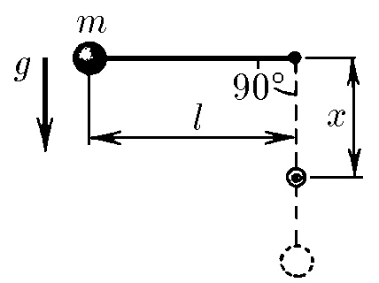
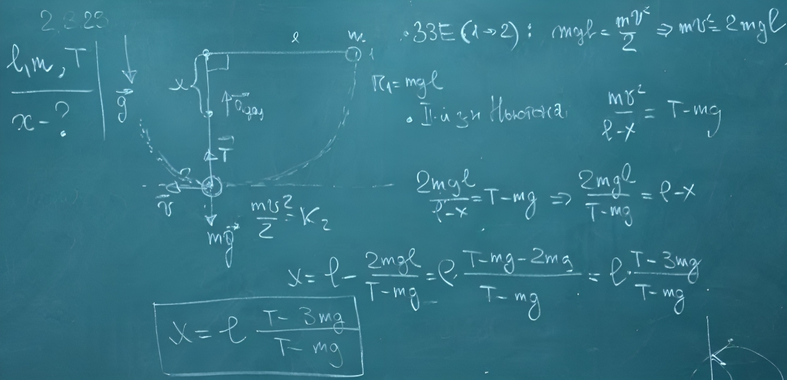

###  Условие:

$2.3.23.$ Нить длины $\ell$ с привязанным к ней шариком массы $m$ отклонили на $90^{\circ}$ от вертикали и отпустили. На каком наименьшем расстоянии под точкой подвеса нужно поставить гвоздь, чтобы нить, налетев на него, порвалась? Нить выдерживает силу натяжения $T$.

###  Решение:

#### Ответ: $x = \ell\frac{T − 3mg}{T − mg}$