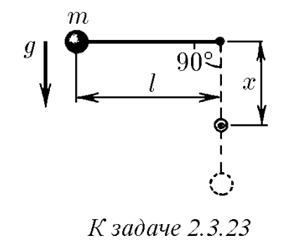

###  Условие: 

$2.3.23.$ Нить длины $l$ с привязанным к ней шариком массы $m$ отклонили на $90^{\circ}$ от вертикали и отпустили. На каком наименьшем расстоянии под точкой подвеса нужно поставить гвоздь, чтобы нить, налетев на него, порвалась? Нить выдерживает силу натяжения $T$. 

 

###  Решение: 

 

###  Ответ: $x = l\frac{T − 3mg}{T − mg}$ 

### 
