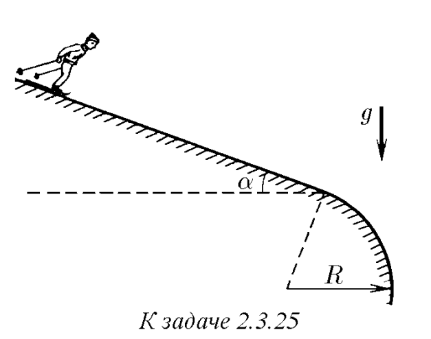
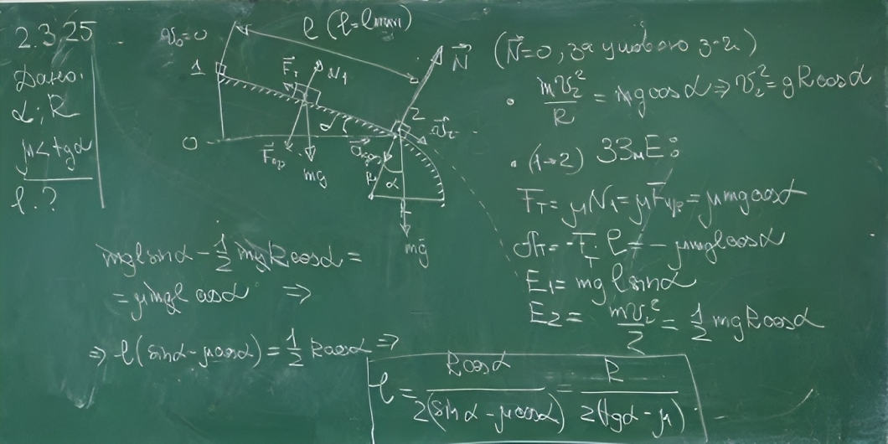

###  Условие: 

$2.3.25.$ На каком минимальном расстоянии от места закругления склона должна располагаться стартовая площадка лыжников, чтобы они, достигнув закругления, начали свободный полет? Угол склона $\alpha$, радиус его закругления $R$, коэффициент трения между лыжами и снегом $\mu < \tan\alpha $. Стартовой скоростью лыжников пренебречь 

 

###  Решение: 

 

###  Ответ: $L_{мин} =\frac{R}{2(\tan\alpha − \mu )}$ 

### 
