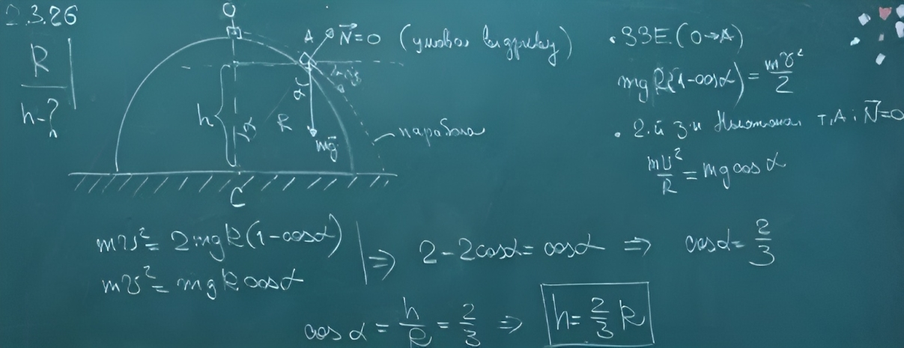

###  Условие: 

$2.3.26.$ С вершины гладкой полусферы радиуса $R$, неподвижно стоящей на горизонтальной плоскости, соскальзывает небольшое тело. На какой высоте над этой плоскостью оно оторвется от полусферы? 

###  Решение: 

 

###  Ответ: $h = 2R/3$ 

### 
