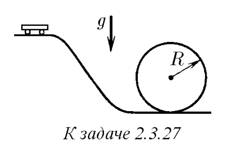
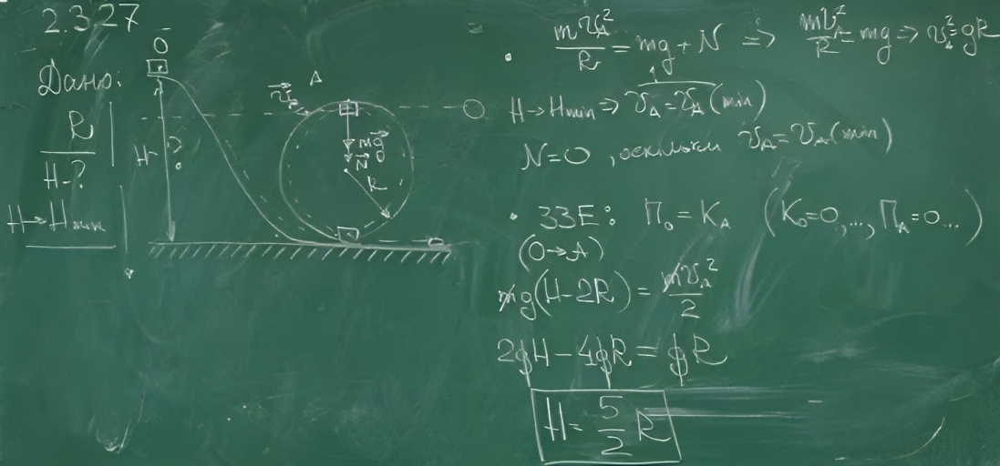
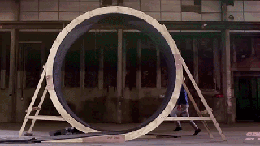

###  Условие: 

$2.3.27.$ Тележка скатывается по гладким рельсам, образующим вертикальную петлю радиуса R. С какой минимальной высоты от нижней точки петли должна скатиться тележка для того, чтобы не покинуть рельсы по всей их длине? 

 

###  Решение: 

 

  

Распределение сил 

  

Бегом по "мертвой петли" 

###  Ответ: $h = 2.5R$ 

### 
