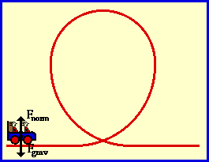

###  Условие:

$2.3.27.$ Тележка скатывается по гладким рельсам, образующим вертикальную петлю радиуса $R$. С какой минимальной высоты от нижней точки петли должна скатиться тележка для того, чтобы не покинуть рельсы по всей их длине?

###  Решение:

#### Ответ: $h = 2.5R$