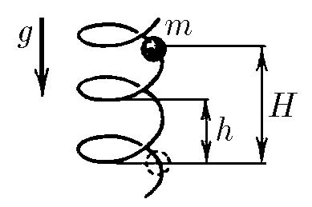

###  Условие:

$2.3.28^*.$ По вертикально стоящей гладкой и твердой спирали скользит бусинка массы $m$. Радиус петли спирали равен $R$, шаг спирали (расстояние по вертикали между соседними витками) — $h$. С какой силой бусинка действует на спираль в момент, когда она спустилась по вертикали на расстояние $H$? Начальная скорость бусинки равна нулю.

###  Решение:

Угол наклона $\alpha$ винтовой линии к горизонтали задается через тригонометрию:

$$
\sin\alpha = \frac{h_{0}}{\sqrt{h_{0}^{2} + (2\pi r)^2}}\tag{1}
$$

Потенциальная энергия, потерянная бусинкой при спуске на высоту $H$, переходит в кинетическую энергию:

$$
E_{кин} = mgH\tag{2}
$$

Учитывая, что начальная скорость равна нулю, находим скорость $v$ бусинки:

$$
v=\sqrt{2gH}\tag{3}
$$

Полная сила $F$, с которой бусинка действует на спираль, находится как сумма проекций центростремительной и нормальной сил:

$$
F = \sqrt{ F_{центр}^{2} + F_{норм}^{2}}\tag{4}
$$

Центростремительная сила $F_{центр}$ возникает из-за движения бусинки по окружности радиуса $R$ в горизонтальной плоскости. Учитывая горизонтальную проекцию скорости $(v_{гор} = v\cos\alpha)$, находим центростремительную силу

$$
F_{центр}  = \frac{mv_{гор}^{2}}{r} = \frac{mv^{2}}{r [1 + (h_{0}/2 \pi r)^{2}]}\tag{5}
$$

Нормальную силу найдём как проекцию силы тяжести на перпендикуляр к поверхности спирали:

$$
F_{норм} = mg \cos\alpha = mg \frac{2 \pi r}{\sqrt{h_{0}^{2} + (2\pi r)^2}}\tag{6}
$$

Подставляем уравнения центростремительной и нормальной сил из $(5)$ и $(6)$, соответственно, в уравнение $(4)$ для силы, с которой бусинка действует на спираль

$$
F = \frac{mg}{1 + (h_{0}/2 \pi r)^{2}} \left [ 1 + \left ( \frac{h_{0}}{2 \pi r} \right )^{2} + \left ( \frac{2h_{0}}{r} \right )^{2} \right ]^{1/2}\tag{7}
$$

####  Ответ: $F=\frac{2\pi Rmg}{4\pi^2R^2+h^2}$$\sqrt{4\pi^2R^2+h^2+16\pi^2H^2}$