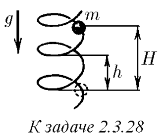

###  Условие: 

$2.3.28^*.$ По вертикально стоящей гладкой и твердой спирали скользит бусинка массы $m$. Радиус петли спирали равен $R$, шаг спирали (расстояние по вертикали между соседними витками) — $h$. С какой силой бусинка действует на спираль в момент, когда она спустилась по вертикали на расстояние $H$? Начальная скорость бусинки равна нулю. 

 

###  Решение: 

###  Ответ: $F=\frac{2\pi Rmg}{4\pi^2R^2+h^2}$$\sqrt{4\pi^2R^2+h^2+16\pi^2H^2}$ 
