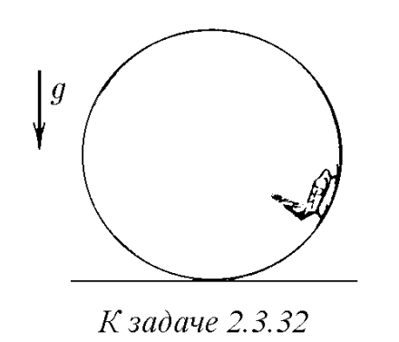
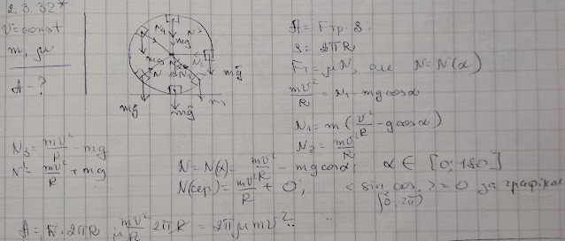
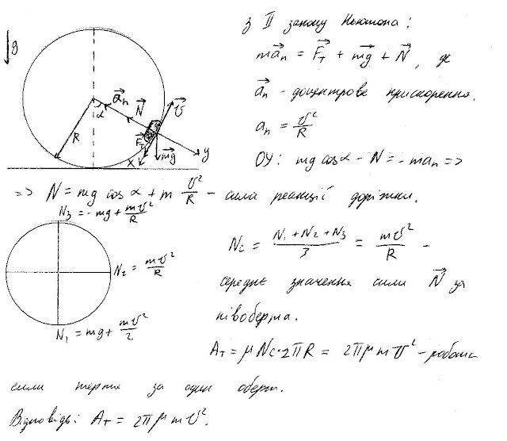

###  Условие: 

$2.3.32^*.$ Какова работа силы трения за один оборот аэросаней, движущихся по вертикальной круговой дорожке? Скорость саней постоянна и равна $v$, масса саней $m$, коэффициент трения $\mu$. 

 

###  Решение: 

 

###  Альтернативное решение: 

 

###  Ответ: $A = 2\pi\mu mv^2$ 

### 
