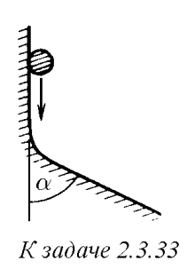

###  Условие: 

$2.3.33^{∗}.$ Тело скользит по плоской поверхности, плавно переходящей в другую плоскую поверхность, расположенную под углом $\alpha$ к первой. Коэффициент трения $\mu$. Определите кинетическую энергию в конце участка сопряжения поверхностей, если в начале она равна $K_0$. 

 

###  Решение: 

 

 

###  Ответ: $K = K_0 e^{−2\mu\alpha}$ 

### 
