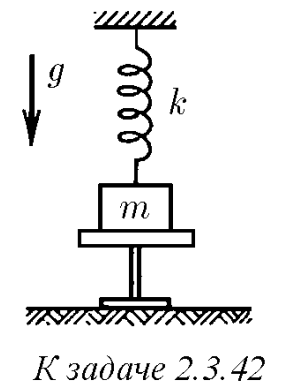
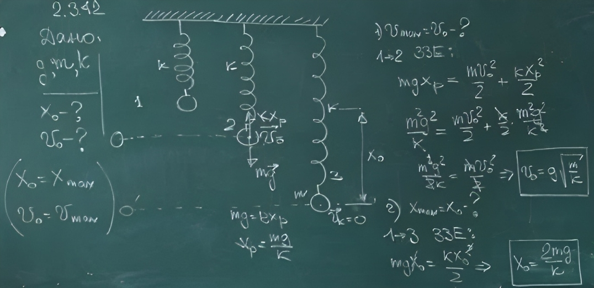

###  Условие: 

$2.3.42.$ Груз массы $m$, подвешенный на пружине жесткости $k$, находится на подставке. Пружина при этом не деформирована. Подставку быстро убирают. Определите максимальное удлинение пружины и максимальную скорость груза. 

 

###  Решение: 

 

###  Ответ: $h= 2mg/k;$ $v = g\sqrt{m/k}$ 

### 
