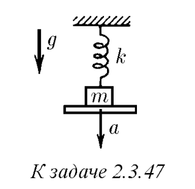
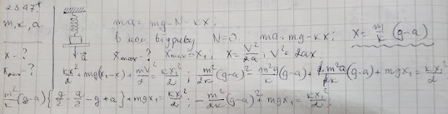
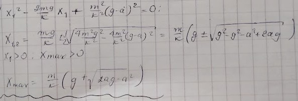

###  Условие: 

$2.3.47^*.$ Тело массы $m$, подвешенное на пружине жесткости $k$, лежит на доске таким образом, что пружина не деформирована. Доску начинают опускать с ускорением $a$. Чему равно удлинение пружины в момент отрыва тела от доски? Каково максимальное удлинение пружины? 

 

###  Решение: 

 

 

###  Ответ: $x = (m/k)(g − a);$ $x_{макс} = (m/k)$$(g + \sqrt{2ga − a^2})$ 

### 
