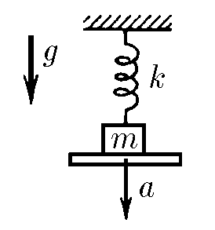
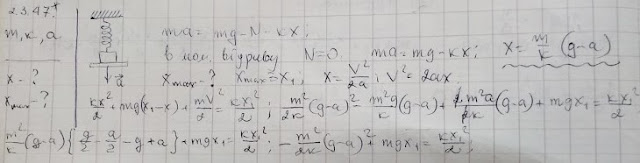
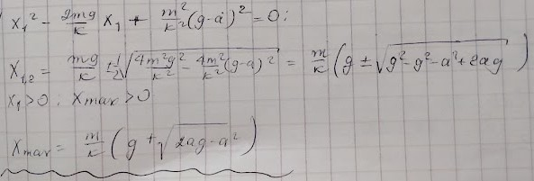

###  Условие:

$2.3.47^*.$ Тело массы $m$, подвешенное на пружине жесткости $k$, лежит на доске таким образом, что пружина не деформирована. Доску начинают опускать с ускорением $a$. Чему равно удлинение пружины в момент отрыва тела от доски? Каково максимальное удлинение пружины?

### Решение:

### Альтернативное Решение:

#### Ответ: $x = (m/k)(g − a);~x_{макс} = (m/k)$$(g + \sqrt{2ga − a^2})$