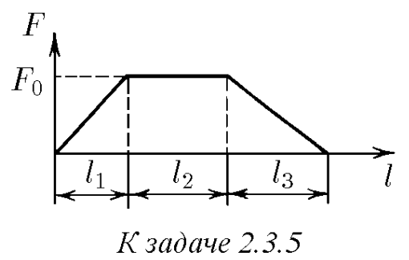
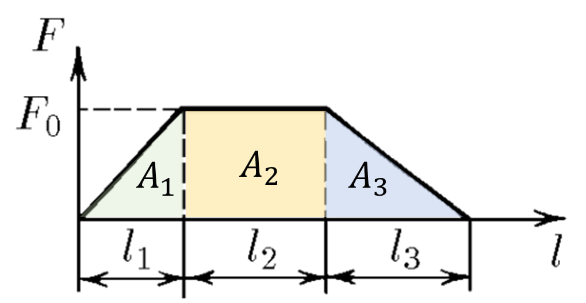

###  Условие: 

$2.3.5.$ Сила, действующая на снаряд массы $m$ в стволе орудия, нарастает равномерно от нуля до $F_0$ на участке ствола длины $l_1$, не меняется на участке ствола длины $l_2$ и, наконец, равномерно уменьшается до нуля на участке ствола длины $l_3$. Какова скорость снаряда при вылете из ствола? 

###  Решение: 

 

Из закона сохранения механической энергии:  $E_{мех}=A_1+A_2+A_3=\frac{mv^2}{2}\quad(a)$  $A_1$, $A_2$ и $A_3$ можно найти как площадь под графиком  $A_1=\frac{1}{2}F_0\cdot l_1$ $A_2=F_0\cdot l_2$ $A_3=\frac{1}{2}F_0\cdot l_3$  Подставляем в $(a)$:  $E_{мех}=A_1+A_2+A_3$ $E_{мех}=F_0\cdot \frac{l_1+2l_2+l_3}{2}$ $F_0\cdot \frac{l_1+2l_2+l_3}{2} = \frac{mv^2}{2}$  Выражаем $v$:  $ v=\sqrt{\frac{F_0(l_1+2l_2+l_3)}{m}}$ 

###  Ответ: $ v=\sqrt{\frac{F_0(l_1+2l_2+l_3)}{m}}$  
  

