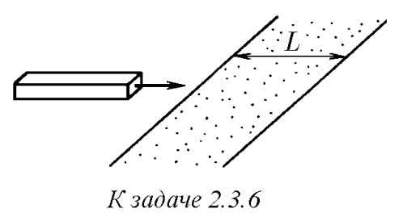

###  Условие: 

$2.3.6.$ Однородный брусок, скользящий по гладкой горизонтальной поверхности, попадает на шероховатый участок этой поверхности ширины $L$, коэффициент трения о который $\mu$. При какой начальной скорости он преодолеет этот участок? 

###  Решение: 

 

На брусок действует постоянная сила трения скольжение $\vec{F}_{тр}$:  $\vec{F}_{тр}=\mu\vec{N}$ $\vec{F}_{тр}=\mu m\vec{g}$  Из закона сохранения механической энергии:  $F_{тр} x = \frac{mv_0^2}{2}-\frac{mv^2}{2}$ $\mu m g x = \frac{mv_0^2}{2}-\frac{mv^2}{2}$ $\mu g x = \frac{v_0^2}{2}-\frac{v^2}{2}$ $v = \sqrt{v_0^2-2\mu g x}$  Где $v_0$ – начальная скорость Тело остановится если $v=0$:  $\sqrt{v_0^2-2\mu g x} = 0$ $v_0^2=2\mu g x$  Т.е. тело остановится на расстоянии $x$:  $x=\frac{v_0^2}{2\mu g }$  Условие прохождение полосы:  $x\geq L$ $\frac{v_0^2}{2\mu g } \geq L$ $ v_0 \geq \sqrt{2\mu gL}$ 

###  Ответ: $ v \geq \sqrt{2\mu gL}$  
  

