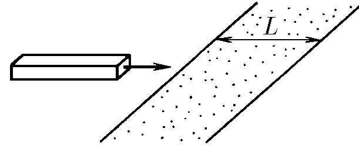
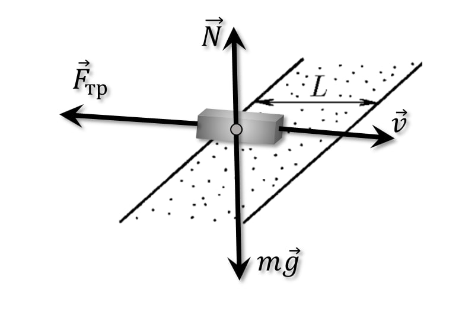

###  Условие:

$2.3.6.$ Однородный брусок, скользящий по гладкой горизонтальной поверхности, попадает на шероховатый участок этой поверхности ширины $L$, коэффициент трения о который $\mu$. При какой начальной скорости он преодолеет этот участок?

###  Решение:

На брусок действует постоянная сила трения скольжение $\vec{F}_{тр}$, которую найдём из закона Амантона-Ньютона

$$
\vec{F}_{тр}=\mu\vec{N} \tag{1}
$$

$$
\vec{F}_{тр}=\mu m\vec{g} \tag{2}
$$

Из закона сохранения механической энергии:

$$
F_{тр} x = \frac{mv_0^2}{2}-\frac{mv^2}{2} \tag{3}
$$

Подставление значение для силы трения $ F_{тр} $ из $(2)$

$$
\mu m g x = \frac{mv_0^2}{2}-\frac{mv^2}{2} \tag{4}
$$

Сокращяем на массу бруска $m$

$$
\mu g x = \frac{v_0^2}{2}-\frac{v^2}{2} \tag{5}
$$

Выражаем скорость бруска

$$
v = \sqrt{v_0^2-2\mu g x} \tag{6}
$$

Где $v_0$ – начальная скорость бруска

Брусок остановится если $v=0$:

$$
\sqrt{v_0^2-2\mu g x} = 0 \tag{7}
$$

Из области определения функции

$$
v_0^2-2\mu g x \geq 0\Rightarrow \boxed{v_0\geq\sqrt{2\mu g x}}
$$

Решая уравнение $(7)$, получаем

$$
v_0^2=2\mu g x \tag{8}
$$

Т.е. тело остановится на расстоянии $x$:

$$
x=\frac{v_0^2}{2\mu g } \tag{9}
$$

Условия прохождение полосы:

$$
x\geq L;\quad \frac{v_0^2}{2\mu g } \geq L;\quad v_0 \geq \sqrt{2\mu gL}
$$

#### Ответ: $ v \geq \sqrt{2\mu gL}$