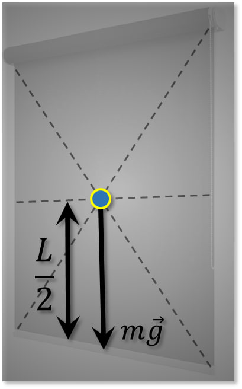

###  Условие: 

$2.3.7.$ Оконную штору массы $m=1 \,кг$ и длины $2 \,м$ свертывают в тонкий валик над окном. Какова наименьшая затрачиваемая при этом работа? Трением пренебречь. 

###  Решение: 

 

Необходимо поднять центр масс штор(прямоугольника) на высоту $\frac{L}{2}$:  

$$A=mg\frac{L}{2}=10\mathrm{~Н}$$ 

####  Ответ: $ A= 10\,Н$  
  

