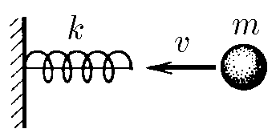
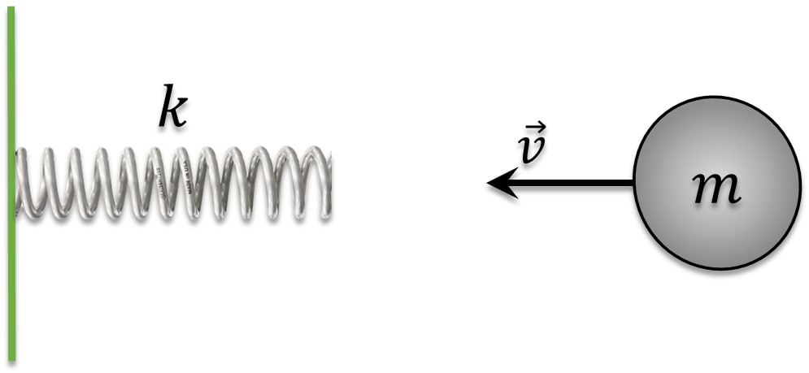
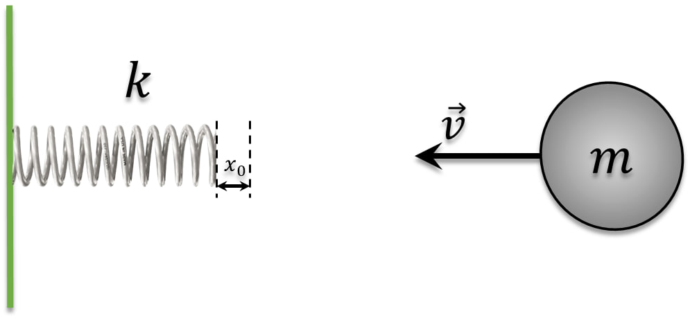

###  Условие: 

$2.3.8.$ Пружина жесткости $k$ прикреплена одним концом кнеподвижнойстенке. На другой ее конец вдоль пружины с начальной скоростью $v$ налетает шар массы $m$. Какова наибольшая деформация сжатия пружины? Ответьте на этот же вопрос для случая, когда пружина предварительно сжата и удерживается нерастяжимой нитью, связывающей ее концы (начальная деформация пружина равна $x_0$) 

###  Решение: 

 

Т.к. пружина закреплена, из закона сохранения энергии, энергия сжатой пружины равна начальной кинетической энергии шарика:  

$$E_{кин}=E_{пр}$$ 

$$\frac{mv^2}{2}=\frac{kx^2}{2}$$ 

Откуда находим максимальное сжатие пружины для случая а)

$$x=v\sqrt{\frac{m}{k}}\tag{a}$$

 

Для случая $2$ пружина изначально имеет некоторую начальную энергию $\frac{kx_0^2}{2}$:  
$$E_{кин}=E_{пр}$$ 

Энергия сжатой пружины равна начальной кинетической энергии шарика

$$\frac{kx^2}{2}-\frac{kx_0^2}{2}=\frac{mv^2}{2}$$ 

Разделим обе части уравнения на жесткость пружины $k$

$$x^2=x_0^2+\frac{m}{k}v^2$$ 

Откуда находим максимальное сжатие пружины 

$$x=\sqrt{x_0^2+\frac{m}{k}v^2}\tag{b}$$  

Заметим, что при $x_0=0$, мы получаем выражение $(a)$ 

####  Ответ: $ x=v\sqrt{\frac{m}{k}};~x=\sqrt{x_0^2+\frac{m}{k}v^2}$  
  

