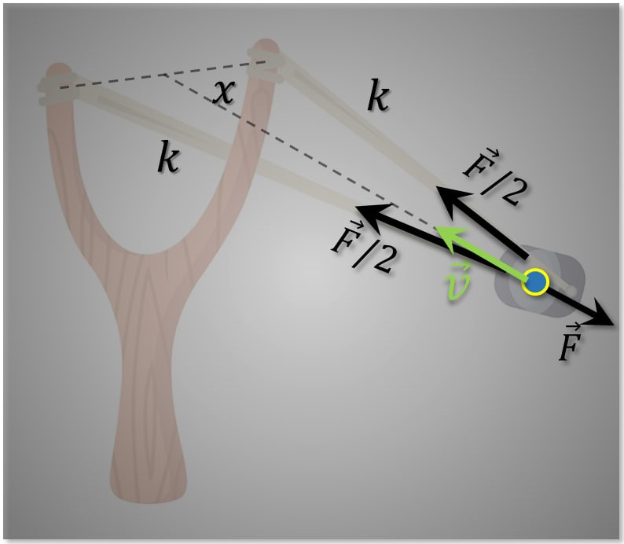

###  Условие: 

$2.3.9.$ Из длинной полоски резины жесткости $k$ сделали рогатку. Найдите кинетическую энергию «снаряда», выпущенного из этой рогатки, если резину растянули с силой $F$ и затем отпустили. 

###  Решение: 

 

Рогатку расстянули на расстояние $x$ c двух концов:  $\frac{F}{2}=kx$ $x=\frac{F}{2k}\quad(a)$  Энергия растяжение резинки при этом стала равна:  $E_{упр}=\frac{kx^2}{2}$ $E_{упр}=\frac{kF^2}{8k^2}$ $E_{упр}=\frac{F^2}{8k}$  Из закона сохранение энергии, вся потенциальная энергия пружины $E_{упр}$ переходит в кинетическую энергию шарика $E_{к}$:  $E_{упр}=E_к$ $E_к=\frac{F^2}{8k}$ 

###  Ответ: $E_к=\frac{F^2}{8k}$  
  

