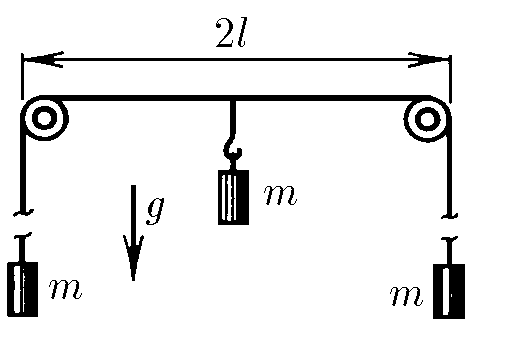
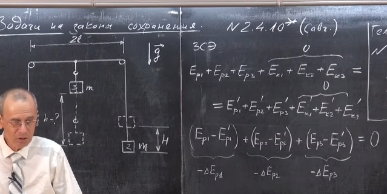
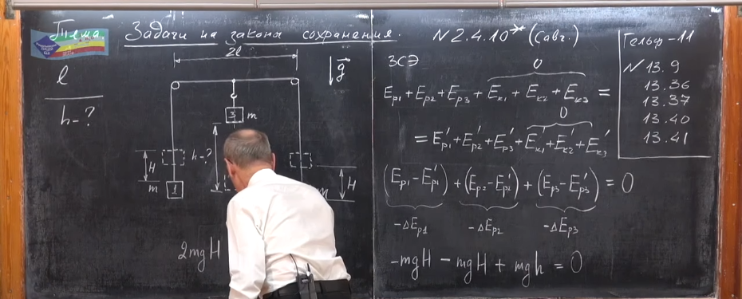
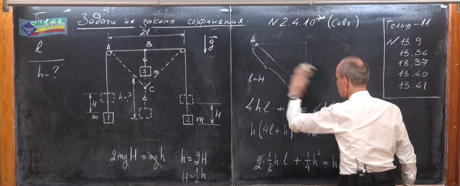
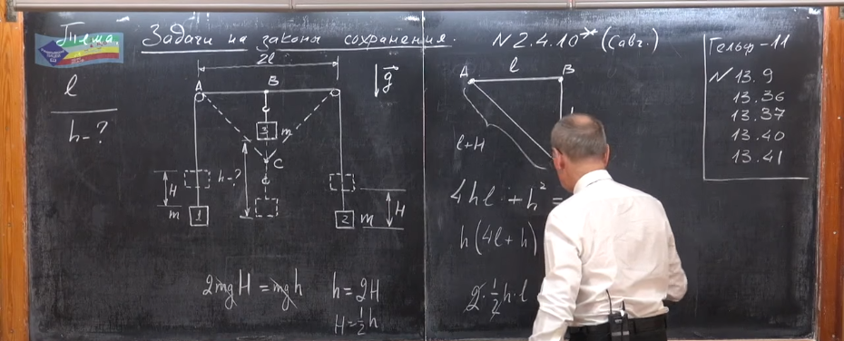
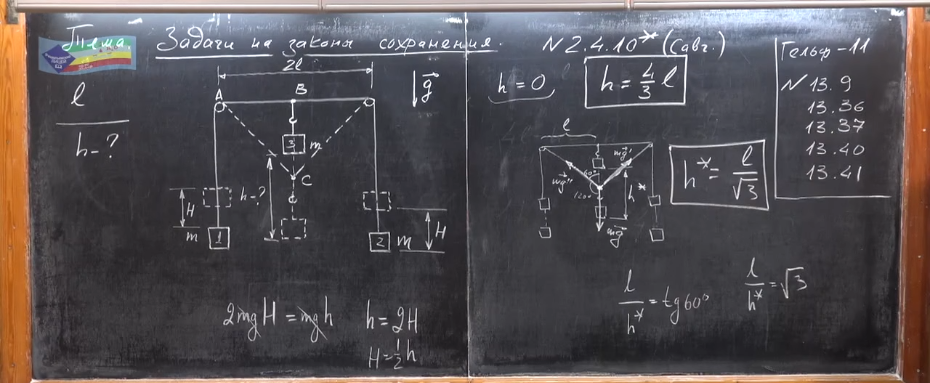

###  Условие: 

$2.4.10^{∗}.$ Систему, изображенную на рисунке, приводит в движение центральный груз массы $m$. Определите максимальное удаление груза от его начального положения 

###  Решение: 

 

 

 

 

 

 

###  Ответ: $ x_{макс} = 4l/3 $ 
