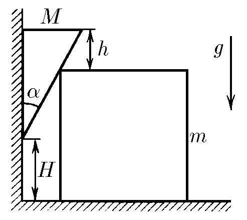

###  Условие: 

$2.4.11^*.$ Клин массы $M$ с углом $\alpha$ при вершине плотно прилегает к вертикальной стенке и опирается на брусок массы $m$, находящийся на горизонтальной плоскости. Вершина клина находится на высоте $H$ над этой плоскостью, а торец клина на высоте $h < H$ над верхней поверхностью бруска. Брусок сначала удерживают в этом положении, а затем его отпускают. Найдите его скорость в момент отрыва от клина. Трением пренебречь. 

###  Решение: 

 

###  Ответ: 

$$
v_m=\operatorname{tg}\alpha\sqrt{\frac{2Mgh}{M+m\operatorname{tg}^2\alpha}}
$$

$$
v_M=\sqrt{\frac{2Mgh}{M+m\operatorname{tg}^2\alpha}+2g(H-h)}
$$