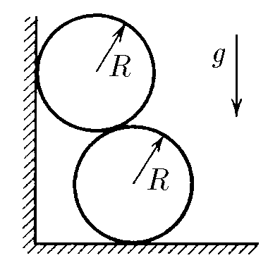
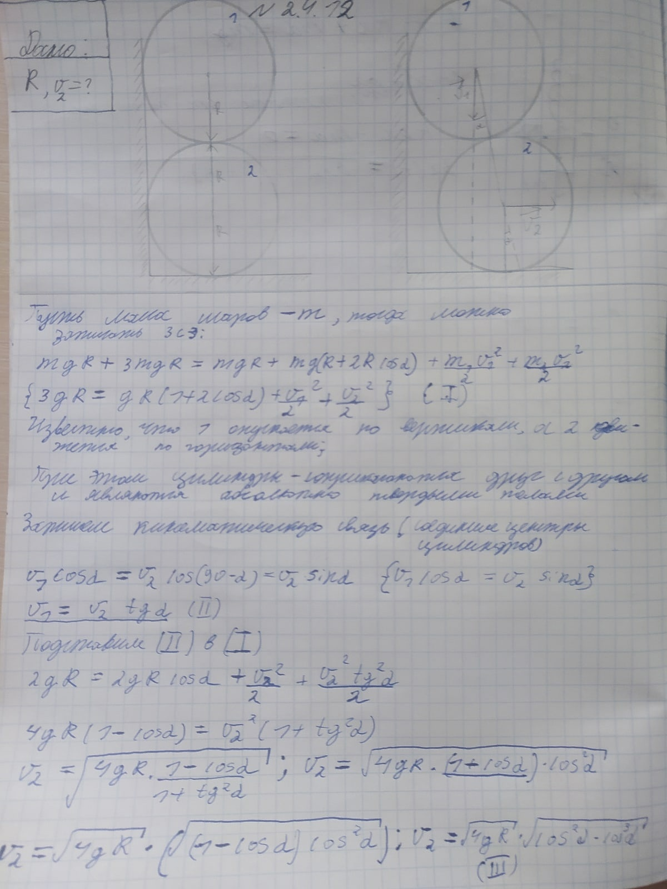
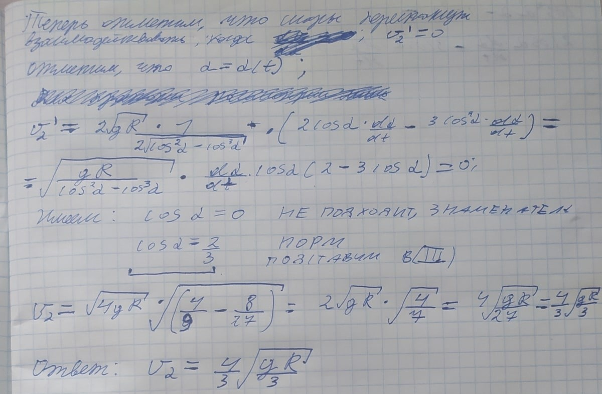

###  Условие:

$2.4.12^*.$ Два гладких одинаковых цилиндра радиуса $R$ прислонены к стенке. Из-за того, что нижний цилиндр чуть-чуть стронулся вправо по горизонтальной плоскости, верхний стал опускаться по вертикали, и система пришла в движение. Найдите конечную скорость нижнего цилиндра.

###  Решение:

#### Ответ: $v = (4/3) \sqrt{gR/3}$