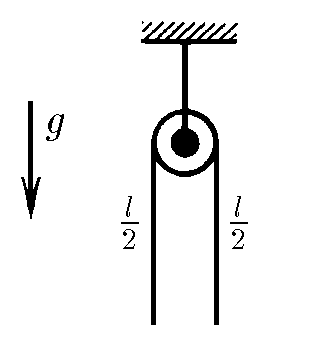
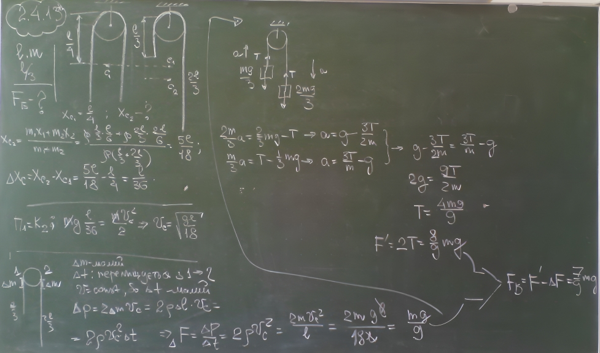

###  Условие: 

$2.4.13^*$ Гладкая однородная веревка длины $l$ и массы $m$ переброшена через небольшой блок так, что вначале находится в равновесии. Веревку немного смещают и она начинает соскальзывать с блока. С какой силой действует она на блок в момент, когда длина веревки с одной стороны от него равна $l/3$? 

 

###  Решение: 

 

###  Ответ: $F = 7mg/9$ 

### 
