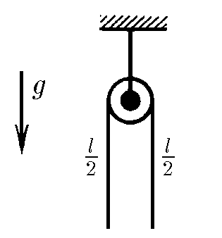
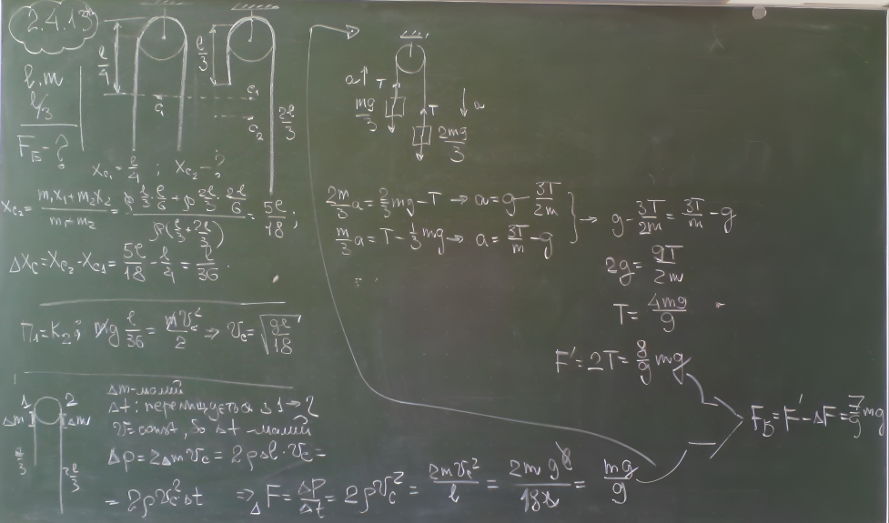

###  Условие:

$2.4.13^*$ Гладкая однородная веревка длины $l$ и массы $m$ переброшена через небольшой блок так, что вначале находится в равновесии. Веревку немного смещают и она начинает соскальзывать с блока. С какой силой действует она на блок в момент, когда длина веревки с одной стороны от него равна $5/2$?

###  Решение:

### Альтернативное Решение:

#### Ответ: $F = 7mg/9$