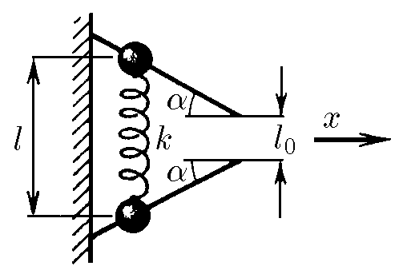

###  Условие: 

$2.4.16.$ Две бусинки массы $m$ каждая, связанные друг с другом пружиной жесткости $k$, удерживают на гладких жестко закрепленных в стене стержнях. Пружина растянута, и ее длина равна $l$. Расстояние между свободными концами стержней равно длине недеформированной пружины. Бусинки отпускают. С какой скоростью будет двигаться пружина в направлении $x$ после того, как бусинки соскочат со стержня? Какой будет наибольшая деформация сжатия пружины? 

###  Решение: 

Сохранение энергии на начальном этапе $$ \frac{k\left(l-l_0\right)^2}{2} = 2\frac{mv^2}{2} $$ Откуда $$ v = \sqrt{\frac{k}{2m}}\left(l-l_0\right) $$ Наибольшее сжатие будет тогда, когда некуда будет сжимать $(v_y=0)$ Альтернатива для горизонтальной проекции $$ v_x=v\cos\alpha ;v_x=\text{const} $$ После замены $$ \boxed{v_x = \sqrt{\frac{k}{2m}}\left(l-l_0\right)\cos\alpha} $$ Сохранение энергии при деформации $x_\text{max}$ $$ \frac{k\left(l-l_0\right)^2}{2} = 2\frac{mv_x^2}{2} + \frac{kx_\text{max}^2}{2} $$ Откуда $$ x_\text{max}^2=\left(l-l_0\right)^2\left(1-\cos^2 \alpha\right) $$ После использования основного тригонометрического тождества: $$ \boxed{x_\text{max} = \left(l-l_0\right) \sin\alpha} $$ 

####  Ответ 

$$\begin{aligned}v_x=(l-l_0)\sqrt{k/(2m)} \cos\alpha ; x=(l-l_0)\sin\alpha .\end{aligned}$$ 
