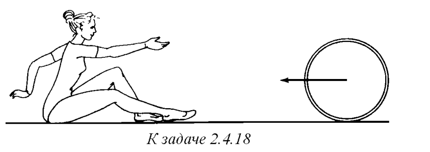
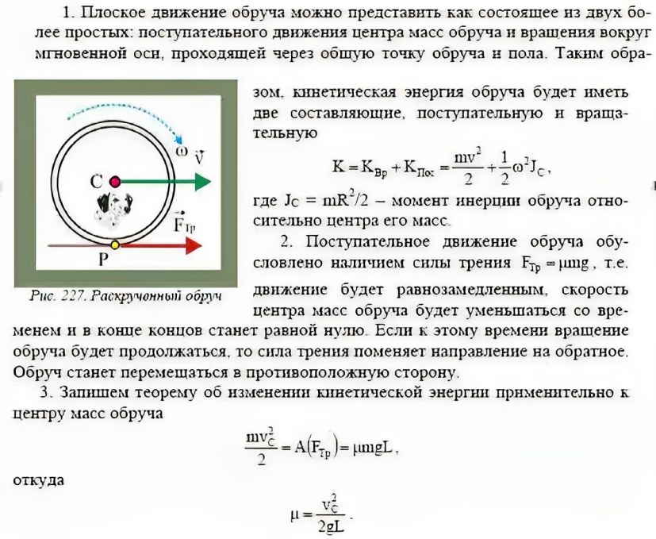

###  Условие: 

$2.4.18.$ Обруч, раскрученный в вертикальной плоскости и посланный по полу рукой гимнастки, через несколько секунд сам возвращается к ней. Объясните это явление. Определите коэффициент трения между обручем и полом, если начальная скорость центра обруча равна $v$, а расстояние, на которое откатывается обруч, равно $l$. 

 

###  Решение: 

 

###  Ответ: $\mu = v^2/(2gl)$ 
