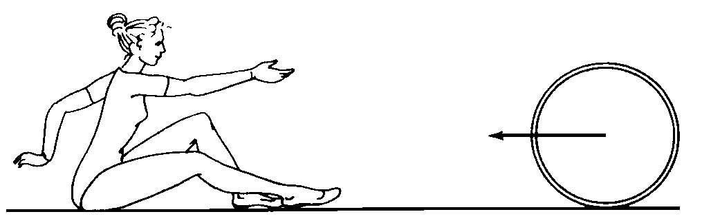

###  Условие: 

$2.4.18.$ Обруч, раскрученный в вертикальной плоскости и посланный по полу рукой гимнастки, через несколько секунд сам возвращается к ней. Объясните это явление. Определите коэффициент трения между обручем и полом, если начальная скорость центра обруча равна $v$, а расстояние, на которое откатывается обруч, равно $l$. 

###  Решение: 

Плоское движение обруча состоит из поступательногр движения центра масс $ C $ с линейной скоростью $ v $ и вращения обруча вокруг центра масс с угловой скоростью $ \omega $.

Общая кинетическая энергия обруча $ K $ суммируется из двух частей:

$$
K = K_{\text{translation}} + K_{\text{rotational}} = \frac{mv^2}{2} + \frac{1}{2} J_C \omega^2,
$$

где $ J_C = \frac{mR^2}{2} $ — момент инерции обруча относительно центра масс.

Сила трения $ F_{\text{fr}} = \mu mg $ вызывает равноускоренное поступательное движение обруча с замедлением. Линейная скорость $ v $ центра масс будет уменьшаться со временем и в какой-то момент станет равной нулю. После этого, если вращение продолжится, сила трения изменит направление, и обруч начнет двигаться в противоположную сторону.

Запишем теорему об изменении кинетической энергии, учитывая работу силы трения $(F_\text{fr} = \mu mg)$:

$$
\frac{mv^2}{2} = \mu mg L 
$$

Из этого уравнения можно найти коэффициент трения $ \mu $:
$$
\mu = \frac{v_c^2}{2gL}.
$$

####  Ответ: $\mu = v^2/(2gl)$ 
