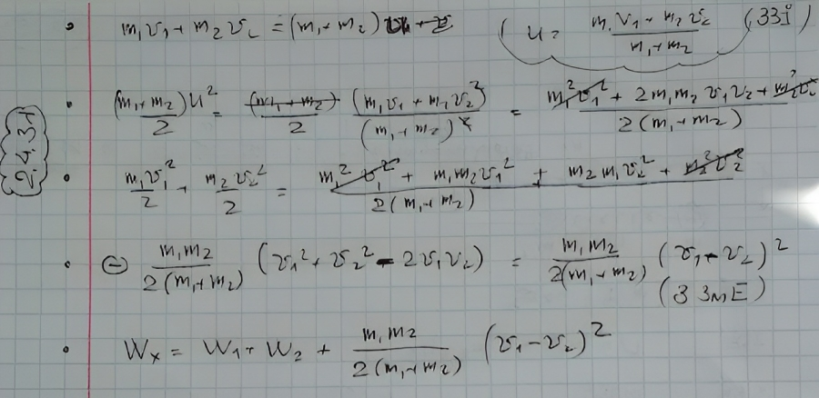

###  Условие:

$2.4.31.$ Два тела массы $m_1$ и $m_2$ имеют внутреннюю энергию $W_1$ и $W_2$ и скорость центров масс $V_1$ и $V_2$. Какова внутренняя энергия системы этих двух тел, если потенциальной энергией взаимодействия их между собой можно пренебречь? Изменится ли эта энергия после столкновения их друг с другом и последующего разлета?

###  Решение:

#### Ответ: $W = W_1 + W_2 + $$\frac{m_1m_2}{2(m_1 + m_2)}(V1 − V2)^2$; нет.