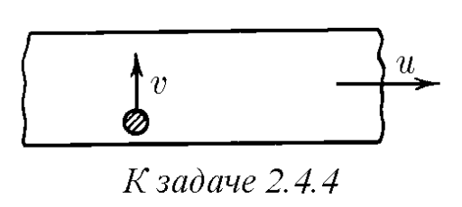

###  Условие: 

$2.4.4^{∗}.$ Лента транспортера движется горизонтально со скоростью $u$. На ленту по касательной к ней летит тело, скорость которого перпендикулярна направлению движения ленты и в момент попадания тела на нее равна $v$. Тело скользит по ленте и затем останавливается. Найдите работу силы трения, приложенной к телу со стороны ленты и к ленте со стороны тела. Почему работа в этих случаях неодинакова? 

 

###  Решение: 

  

###  Ответ: $A_1 = mu^2/2 − mv^2/2;$ $A_2 = −mu^2$ 

### 
