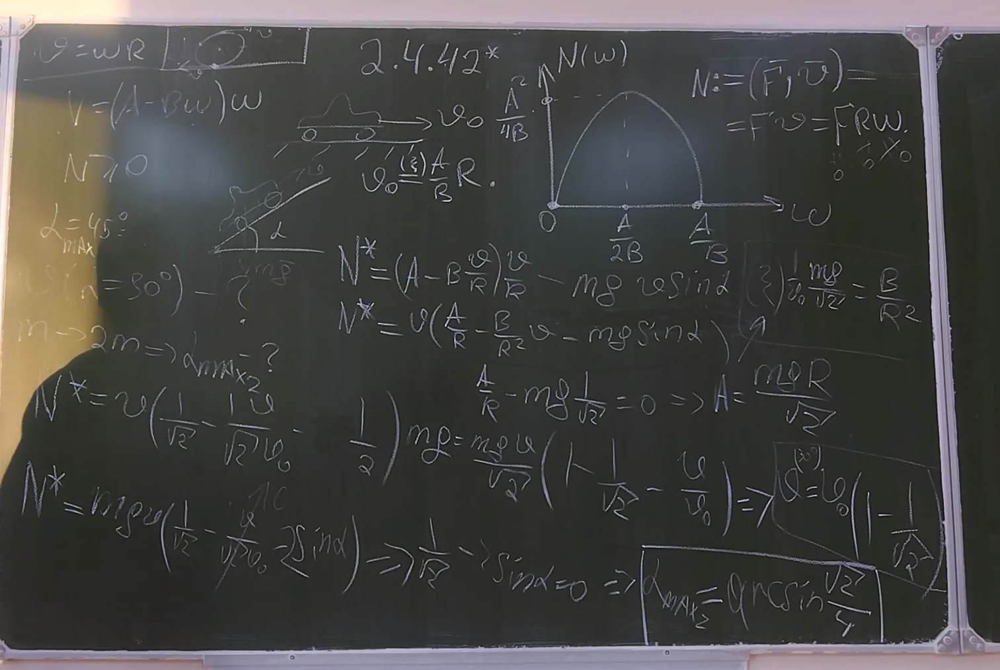

###  Условие:

$2.4.42^{∗}.$ Мощность автомобиля с электрическим двигателем зависит от угловой скорости вращения колес по закону $N = (A−B\omega )\omega$, $N \geq 0$. Установившаяся скорость автомобиля на горизонтальном шоссе $70$ км/ч. Без груза он может преодолевать подъемы с углом наклона шоссе вплоть до $45^{\circ}$ . Какова установившаяся скорость автомобиля при подъеме с углом наклона шоссе $30^{\circ}$ ? Какие подъемы он может преодолевать при массе груза, равной массе автомобиля?

###  Решение:

###  Ответ: $v \approx 20 км/ч; \alpha =\arcsin {\frac{\sqrt{2}}{4}}$