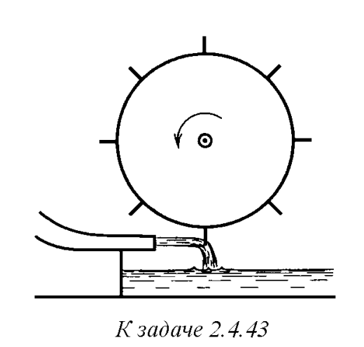
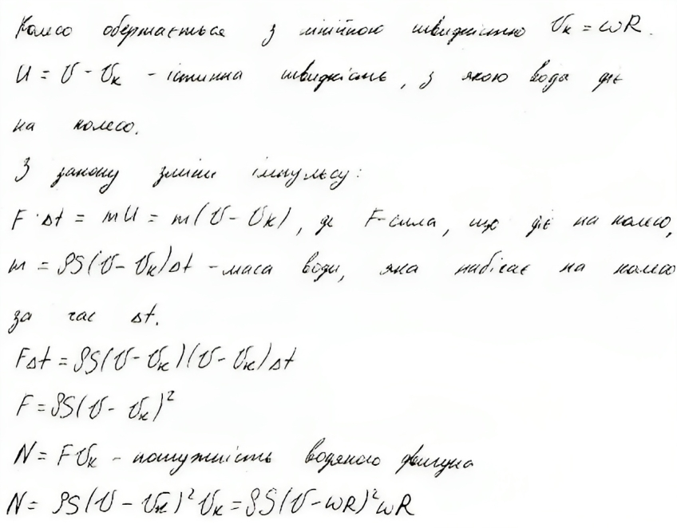

###  Условие: 

$2.4.43^*.$ Струя воды плотности $\rho$ сечения $S$ с горизонтальной скоростью $v$ бьет в лопасти водяного колеса, после удара стекая по лопасти вниз. Найдите мощность этого водяного двигателя при угловой скорости вращения колеса $\omega$. Радиус колеса $R$. Число лопастей достаточно большое, так что воздействие струи можно считать непрерывным, пренебрегая изменениями его при входе лопасти в струю и при выходе из нее. 

 

###  Решение: 

 

###  Ответ: $N = \rho S(v − \omega R)^2\omega R$; 
