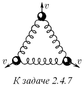
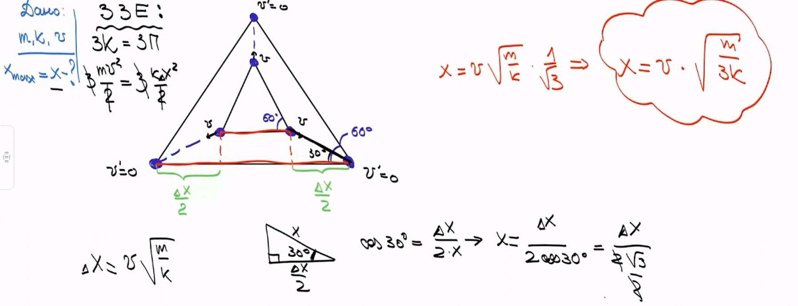

###  Условие: 

$2.4.7$ Три шарика массы $m$ каждый соединены друг с другом одинаковыми пружинами жесткости $k$. Одновременно всем шарикам сообщили скорость $v$, направленную от центра системы. На какое наибольшее расстояние сместятся шарики в этом направлении? 

 

###  Решение: 

 

###  Ответ: $x = \sqrt{m/(3k)}$ 
