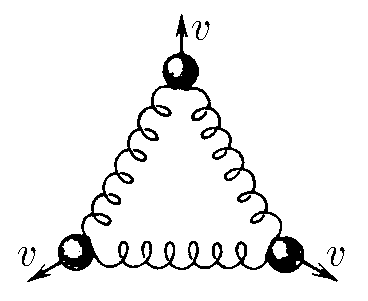
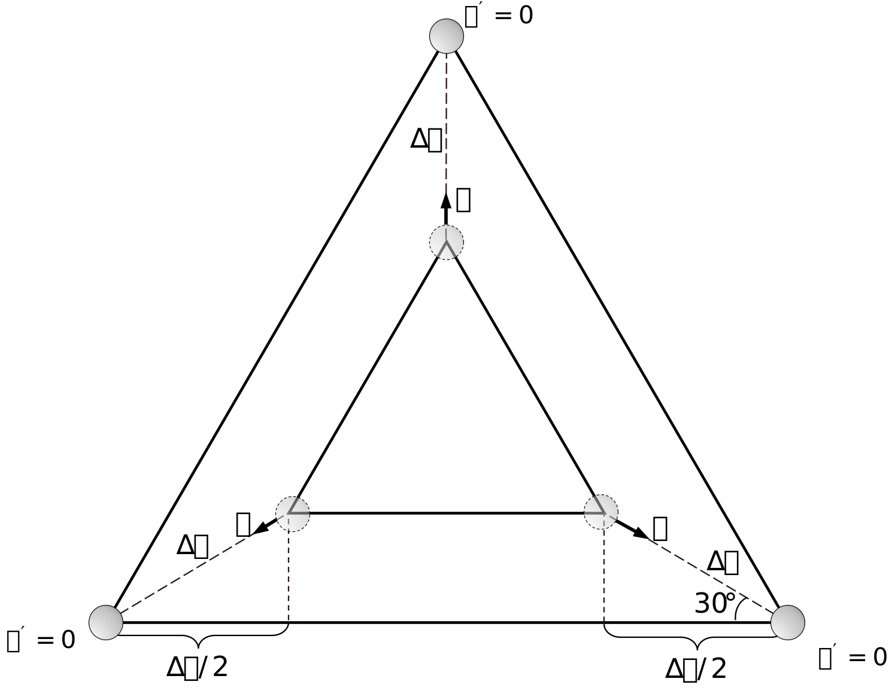

###  Условие:

$2.4.7$ Три шарика массы $m$ каждый соединены друг с другом одинаковыми пружинами жесткости $k$. Одновременно всем шарикам сообщили скорость $v$, направленную от центра системы. На какое наибольшее расстояние сместятся шарики в этом направлении?

###  Решение:

Кинетическая энергия, сообщенная системе, переходит в потенциальную энергию сжатых пружин.

$$
3 \cdot \frac{m v^2}{2} = 3 \cdot \frac{k \Delta x^2}{2} \Leftrightarrow m v^2 = k \Delta x^2
$$

Выразим $ \Delta x $:

$$
\Delta x = v \sqrt{\frac{m}{k}}
$$

#### Ответ: $x = \sqrt{m/(3k)}$