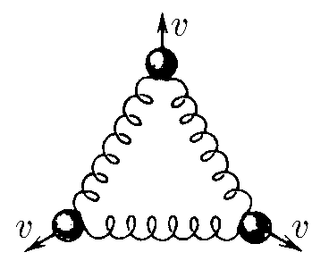
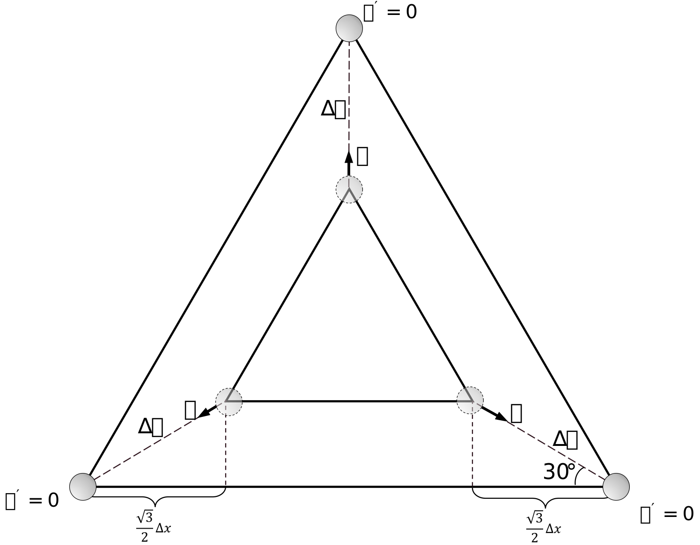

###  Условие:

$2.4.7$ Три шарика массы $m$ каждый соединены друг с другом одинаковыми пружинами жесткости $k$. Одновременно всем шарикам сообщили скорость $v$, направленную от центра системы. На какое наибольшее расстояние сместятся шарики в этом направлении?

###  Решение:

Кинетическая энергия, сообщенная системе, переходит в потенциальную энергию растянутых пружин.

Кинетическая энергия системы в начальный момент времени:
$$
3 \cdot \frac{m v^2}{2}
$$

Удлинение каждой из пружин: 

$$
2(\Delta x \cdot cos(30^\circ)) = \Delta x \sqrt3
$$

Тогда потенциальная энергия всей системы в конечный момент времени: 
$$
3 \cdot \frac{k(\Delta x \sqrt3)^2}{2}
$$

Применив закон сохранения механической энергии, получаем:
$$
3 \cdot \frac{m v^2}{2} = 9 \cdot \frac{k \Delta x^2}{2} \Leftrightarrow m v^2 = 3k \Delta x^2
$$

Выразим $ \Delta x $:

$$
\Delta x = v \sqrt{\frac{m}{3k}}
$$

#### Ответ: $x = v\sqrt{m/(3k)}$