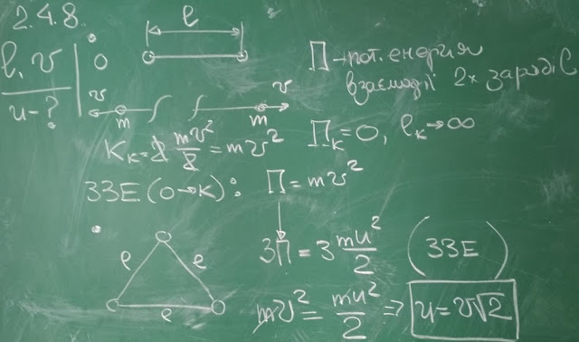

###  Условие:

$2.4.8.$ Два одинаковых заряда, удерживаемых на расстоянии $l$ друг от друга, после того как их отпустили, разлетаются с равными скоростями, стремящимися при бесконечном удалении зарядов друг от друга к предельному значению $v$. Какова предельная скорость, если первоначально три таких же заряда удерживали в вершинах правильного треугольника со сторонами длины $l$?

###  Решение:

#### Ответ: $v'=\sqrt{2}v$