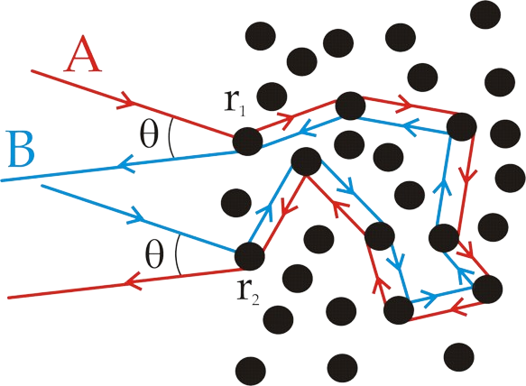

###  Условие: 

$2.5.12.$ При облучении кристалла потоком нейтронов с его поверхности, противоположной бомбардируемой, вылетают атомы, причем направление вылета зависит только от ориентации кристалла и не зависит от направления потока нейтронов. Объясните это явление. 

###  Решение: 

Это явление называется обратным отражением (англ. backscattering) и происходит из-за специфической динамики столкновения нейтронов с атомами в кристаллической решетке. 

Когда поток нейтронов попадает на поверхность кристалла, часть нейтронов проникает внутрь кристалла, а часть отражается. Те нейтроны, которые проникают в кристалл, начинают взаимодействовать с атомами в его объеме. В процессе взаимодействия нейтроны могут изменять свое направление движения, отражаться или поглощаться. 

Но особенность обратного отражения заключается в следующем: если нейтрон не абсорбируется и не изменяет направление настолько, чтобы покинуть кристалл через ту же поверхность, с которой он вошел, то он может достичь обратной поверхности и оттуда выйти из кристалла. 

Направление вылета нейтронов из обратной поверхности кристалла зависит от его ориентации в пространстве. Это связано с тем, что атомы в кристаллической решетке упорядочены в определенном порядке, который определяет траектории нейтронов после внутренних столкновений. Таким образом, даже если направление потока нейтронов одно, ориентация кристалла определяет, какие именно нейтроны вернутся и выйдут из обратной поверхности. 
