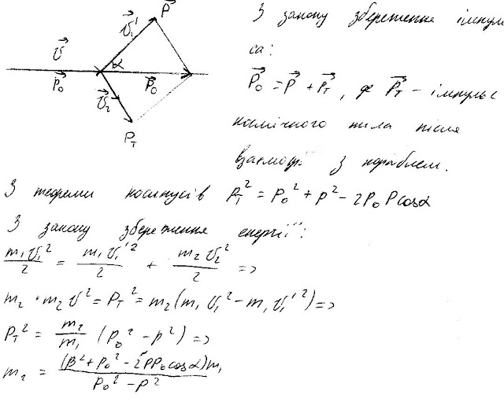
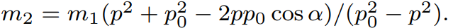

###  Условие: 

$2.5.19.$ Космический корабль массы $m_1$ пролетал с выключенными двигателями вблизи первоначально неподвижного космического тела. При этом импульс корабля, вначале равный $p_0$, стал равным $p$, а направление его движения изменилось на угол $\alpha$. Определите массу космического тела. 

###  Решение: 

 

###  Ответ: 

 
