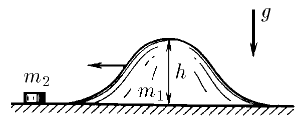
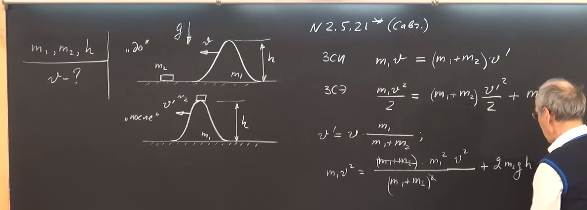
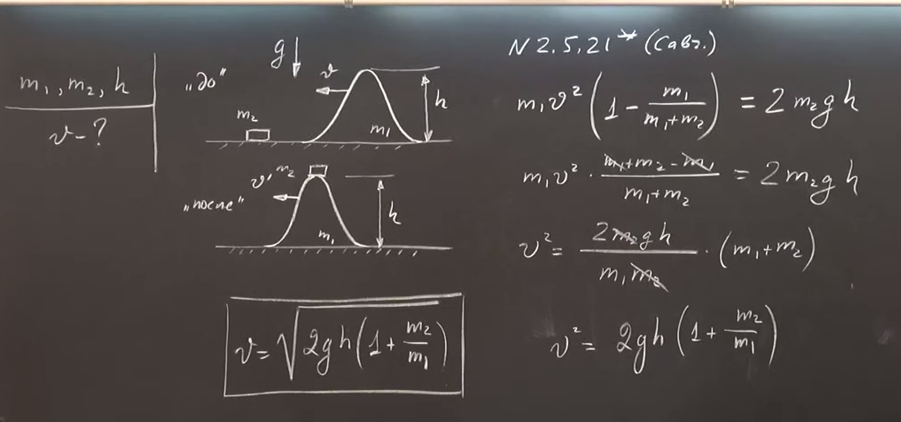

###  Условие: 

$2.5.21^*.$ По горизонтальной плоскости может скользить без трения гладкая «горка» высоты $h$ и массы $m_1$. Горка плавно переходит в плоскость. При какой наименьшей скорости горки небольшое тело массы $m_2$, неподвижно лежащее вначале на ее пути, перевалит через вершину? 

###  Решение: 

 

 

 

###  Ответ: $v = \sqrt {2gh(1 + m_2/m_1)}$ 

### 
