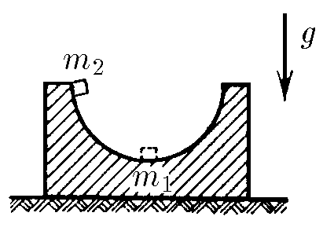
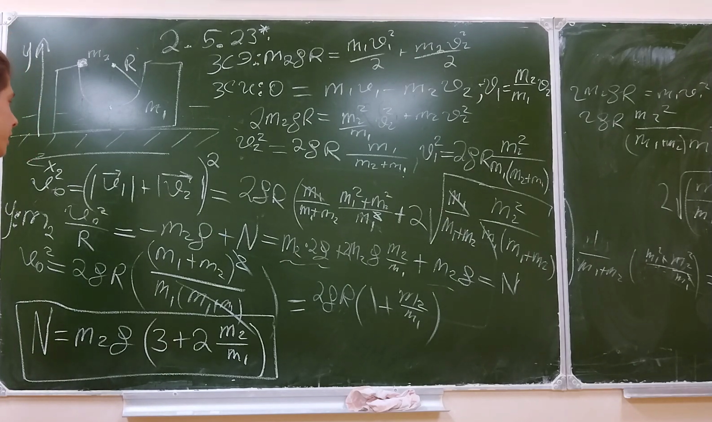

###  Условие: 

$2.5.23^{∗}.$ Подставка массы $m_1$ с полусферической выемкой радиуса $R$ стоит на гладком столе. Тело массы $m_2$ кладут на край выемки и отпускают. Найдите скорость тела и подставки в момент, когда тело проходит нижнюю точку полусферы. С какой силой оно давит на подставку в этой точке? Трением пренебречь. 

###  Решение: 

 

 

###  Ответ: 

### 

$$
v_1=\frac{m_2}{m_1}\sqrt{2gRm_1/(m_1+m_2)}
$$

$$
v_2=\sqrt{2gRm_1/(m_1+m_2)}
$$

$$
N=m_2g(3+2m_2/m_1).
$$