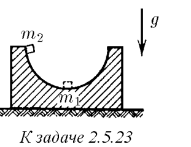
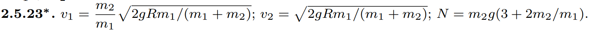

###  Условие: 

$2.5.23^{∗}.$ Подставка массы m1 с полусферической выемкой радиуса R стоит на гладком столе. Тело массы m2 кладут на край выемки и отпускают. Найдите скорость тела и подставки в момент, когда тело проходит нижнюю точку полусферы. С какой силой оно давит на подставку в этой точке? Трением пренебречь. 

 

###  Решение: 

 

 

###  Ответ: 

### 

 
