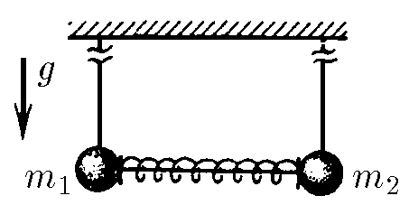
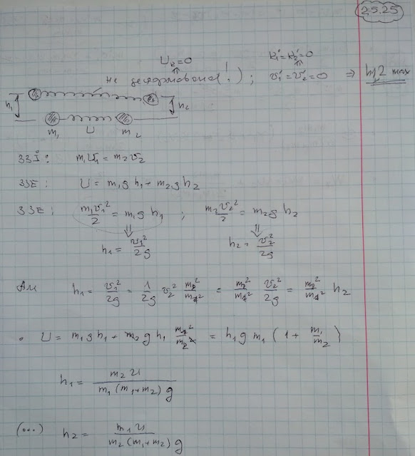

###  Условие:

$2.5.25.$ Два шарика массы $m_1$ и $m_2$ висят на длинных одинаковых нитях. Между ними находится сжатая пружина, которая удерживается в сжатом состоянии связывающей ее нитью. Потенциальная энергия деформации пружины $U$. Нить, связывающую пружину, пережигают. Найдите максимальную высоту, на которую поднимутся шарики.

###  Решение:

#### Ответ:

$$
h_{1\mathrm{макс}}=\frac{m_{2}U}{m_{1}g(m_{1}+m_{2})};\quad h_{2\mathrm{макс}}=\frac{m_{1}U}{m_{2}g(m_{1}+m_{2})}.
$$