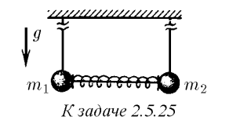
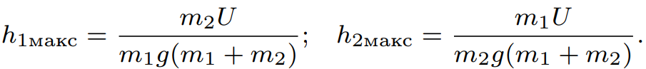

###  Условие: 

$2.5.25.$ Два шарика массы $m_1$ и $m_2$ висят на длинных одинаковых нитях. Между ними находится сжатая пружина, которая удерживается в сжатом состоянии связывающей ее нитью. Потенциальная энергия деформации пружины $U$. Нить, связывающую пружину, пережигают. Найдите максимальную высоту, на которую поднимутся шарики. 

 

###  Решение: 

 

###  Ответ: 

 
