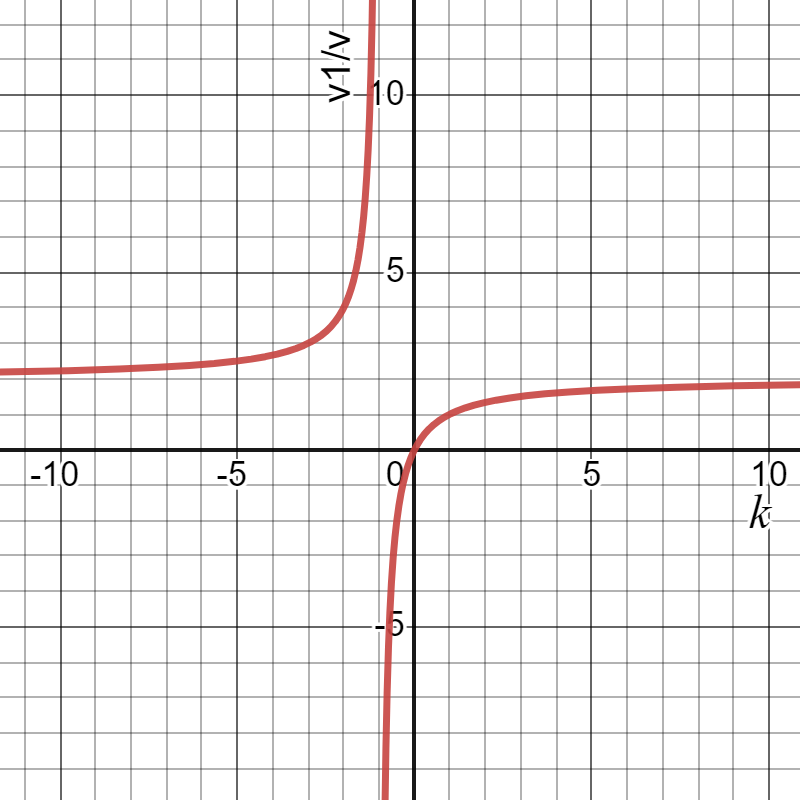
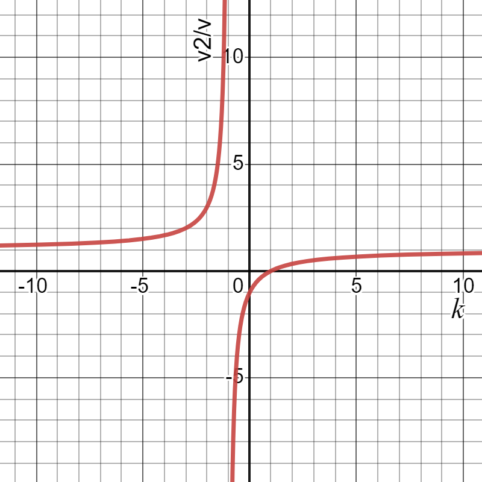

###  Условие: 

$2.5.3.$ На неподвижный шар налетает со скоростью $u$ шар, масса которого в $k$ раз больше массы неподвижного шара. Найдите отношение скорости шаров после центрального упругого удара к скорости $u$. Постройте графики зависимости этих отношений от числа $k$. 

###  Решение: 

Запишем закон сохранения импульса $km\vec{u} = km\vec{v_2} + m\vec{v_1}$. В проекции на ось $x$: $kmu = kmu_2 + mv_1$, или $ku = kv_2 + v_1$. (1) Для упругого удара выполняется закон сохранения кинетической энергии $\frac{kmu^2}{2} = \frac{kmv_2^2}{2} + \frac{mv_1^2}{2}$, или $ku^2 = kv_2^2 + v_1^2$. (2) Перепишем уравнения (1) и (2) $k(u – v_2) = v_1$, $k(u^2 – v_2^2) = v_1^2$ Разделив левые и правые части уравнений соответственно, получим $u + v_2 = v_1$. (3) Сделаем замену найденной скорости $v_1$ в уравнение (1) $ku = kv_2 + u + v_2$, откуда $v_2 = \frac{u(k - 1)}{k + 1}$. (4) Если теперь подставить найденную скорость $v_2$ из (4) в уравнение (3), то $v_1 = \frac{2ku}{k + 1}$. (5) Найдем отношение скоростей $v_1$ и $v_2$ к $u$ $\frac{v_1}{u} = \frac{2k}{k + 1}$, $\frac{v_2}{u} = \frac{k - 1}{k + 1}$. (*) Для построения графика зависимости отношения скоростей от $k$, надо в формулы (*) вместо $k$ подставить значения, например $\frac{1}{2}, 1, 2, 3, \infty$. Тогда графики будут иметь вид, представленный на рисунке. 

 

 

###  Ответ: $\fbox{$\frac{v_1}{u} = \frac{2k}{k + 1}$, $\frac{v_2}{u} = \frac{k - 1}{k + 1}$}$ 
