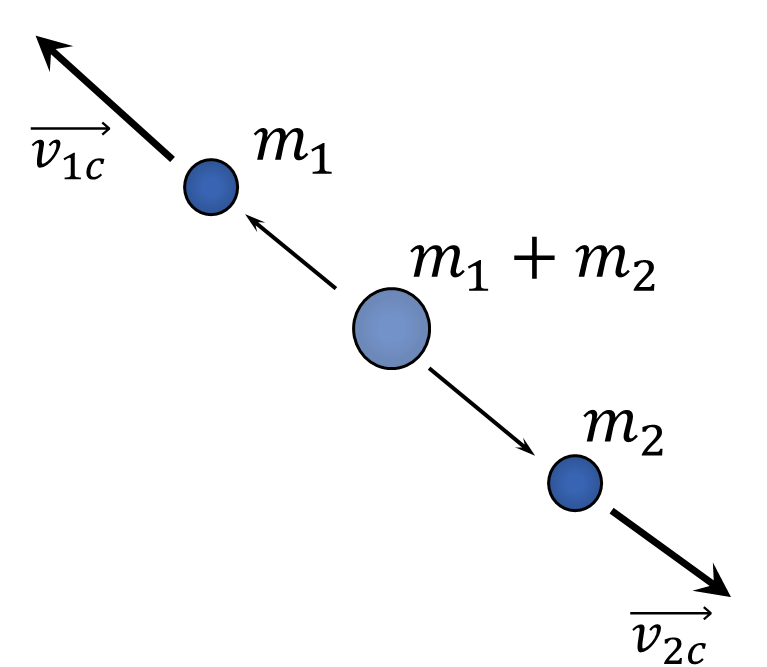

###  Условие:

$2.5.34^*.$ Частица массы $m$ с импульсом $p$ распадается на две одинаковые частицы. Каков максимальный угол разлета вторичных частиц, если при распаде выделяется энергия $E$?

###  Решение:

В системе центра масс этот распад выглядит так: начальное тело массой $m_1+m_2$ неподвижно, частица 1 и частица 2 разлетаются в противоположные стороны, так как векторная сумма импульсов должна дать 0: (импульсы в центре масс обозначаю индексом с)

$$
\vec p_{1c}+\vec p_{2c}=m_1\vec v_{1c}+m_2\vec v_{2c}=0\Rightarrow m_1v_{1c}=m_2v_{2c}
$$

А теперь нужно использовать условие максимальности угла. Сначала учтем, что скорость тела 1 в изначальной системе отсчета: (можно рассматривать и вектор скорости первого тела - разницы нет)

$$
\vec v_1=\vec v_{1c}+\vec v
$$

Построим треугольник векторов: (угол $\alpha_2$ как известно - угол между вектором скорости начального тела и второго тела в изначальной системе)

Вектор $\vec v_1$ должен являться касательной к окружности (условие максимальности угла), по радиусу которого направлен вектор $\vec v_{1c}$:

Отсюда ясно, что

$$
v_{1c}=v\sin\alpha_1\Rightarrow v_{2c}=\left (\frac{m_1}{m_2}\right)v_{1c}=\left (\frac{m_1}{m_2}\right)v\sin\alpha_1
$$

Разность энергий:

$$
\Delta E=E'-E_0
$$

Так как в системе центра начальное тело массой $m_1+m_2$ неподвижно, то $E_0=0\Rightarrow\Delta E=E'$

$$
E'=\frac{m_1v_{1c}^2}{2}+\frac{m_2c_{2c}^2}{2}
$$

$$
E'=\frac{m_1(v\sin\alpha_1)^2}{2}+\frac{m_1^2(v\sin\alpha_1)^2}{2m_2}
$$

$$
E'=\frac{m_1(v\sin\alpha_1)^2}{2}\left(1+\frac{m_1}{m_2}\right)
$$

$E'$ можно выразить и через $v_2$: (надо повторить то, что было сделано выше, только со вторым телом)

$$
E'=\frac{m_2(v\sin\alpha_2)^2}{2}\left(1+\frac{m_2}{m_1}\right)
$$

Отсюда приравняв эти два выражения для конечной энергии в системе центра можно получить связь между углами и массами тел:

$$
\frac{\sin\alpha_1}{\sin\alpha_2}=\frac{m_2}{m_1}
$$

Дальше воспользоваться тем, что начальная энергия в изначальной системе задана и прийти к конечному ответу:

$$
K=\frac{(m_1+m_2)v^2}{2} \Rightarrow \Delta E=E'=K\sin\alpha_1\sin\alpha_2
$$

####  Ответ:

$\cos\alpha =(p^2-2mE)/(p^2+2mE)$, если $2mE< p^2$

$\alpha =\pi /2,$ если $2mE>p^2$